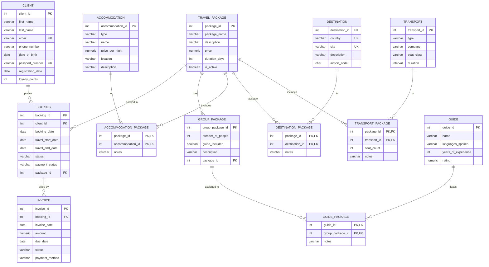

# New Horizons

[](https://github.com/qnicondavid/new-horizons/actions/workflows/ci.yml)

A relational database for a travel agency, written in plain SQL for PostgreSQL. It covers the booking lifecycle: clients and the packages they book, what each package is composed of (accommodations, destinations, and transport), group departures with optional guides, and invoicing with derived balances. The repository holds the schema and constraints, a deterministic sample dataset, reporting and analytical views, an 18-query catalog, a SQL test suite, and a GitHub Actions workflow that builds and checks it all on a real PostgreSQL server.

## Schema



The schema has 13 tables: eight entities (client, travel_package, booking, invoice, accommodation, destination, transport, guide), one table for group departures (group_package), and four junction tables that link a package to its accommodations, destinations, transport, and guides. The diagram above is generated from `sql/ddl.sql`, so it stays in step with the actual definitions.

Constraints live in the DDL rather than in application code. Emails are validated by pattern and stored lowercase, passport numbers are unique, a client's date of birth must precede their registration date, booking dates are ordered, ratings are bounded, airport codes are three uppercase letters, and status and enum-style columns are checked against fixed sets.

## Design decisions

Booked versus collected. The revenue views report expected revenue, computed from each package's list price times its bookings. That is what the agency has sold, which is not the same as what it has banked. Payment status is tracked on the booking and is not derived from invoices, so a report can tell a confirmed sale apart from cash actually received.

Balances are derived, not stored. `fn_booking_balance` and the `v_booking_billing` view both compute a booking's outstanding balance from its invoices at query time. The two share one definition, and a test asserts they always agree. Balance is clamped at zero. Refunds are not modeled, so when a booking is overpaid the surplus appears as `refund_due` rather than a negative balance.

Package price is read from `travel_package`, not copied onto the booking. This keeps the schema smaller and the seed simpler. The trade-off is that editing a package price would change the value of past bookings. At this scale that is an acceptable simplification, and it is noted here rather than left implicit.

`guide_included` is an intent flag. It sits on `group_package` and records whether a departure is meant to include a guide. The actual assignment lives in `guide_package`. Instead of forcing the two to agree with a constraint, a data-quality view reports any mismatch, because the flag and the assignment can reasonably be edited at different times.

## Data-quality views

Six views under the `v_dq_` prefix surface anomalies without blocking writes. They report, they do not enforce:

- `v_dq_invoice_before_booking`: invoices dated before the booking they bill.
- `v_dq_guide_flag_mismatch`: departures whose `guide_included` flag disagrees with their guide assignments.
- `v_dq_overpaid_booking`: active bookings paid beyond what they owe.
- `v_dq_refunded_with_paid_invoice`: bookings marked refunded that still carry a paid invoice.
- `v_dq_uninvoiced_active_booking`: active bookings with no invoice.
- `v_dq_overlapping_client_bookings`: a client booked on two trips whose dates overlap.

Query `q18` runs all six as one dashboard. The test suite asserts the seed is clean against the first three.

## Deliberately deferred

Some things were left out on purpose, to keep the scope honest:

- Refunds and a payment ledger. Payment is a status, not a transaction history, so overpayment is surfaced but not reconciled.
- Absolute date checks against `CURRENT_DATE`. The seed uses fixed dates so builds stay reproducible, and the schema does not reject a booking for sitting in the past.
- Cross-field status rules, for example which booking status may pair with which payment status. These are reported by the data-quality views instead of enforced by constraints, so the seed can carry realistic edge cases.
- Price history, as described in the design note above.

## Analytical queries

Two views go past basic joins and aggregates and use window functions:

- `v_monthly_revenue`: revenue per month with a month-over-month change (`LAG`) and a running total (`SUM OVER`).
- `v_client_ltv`: per-client lifetime value with a quartile bucket (`NTILE`) and a rank.

## Running it

You need a PostgreSQL server. The project is developed and tested against PostgreSQL 16.

Build the schema, seed, views, functions, and indexes:

```
make build
```

Run the assertion suite:

```
make test
```

Smoke-run every query:

```
make queries
```

Or do all three:

```
make check
```

Without make, point psql at the entry script:

```
psql -v ON_ERROR_STOP=1 -f sql/run_all.sql
```

`run_all.sql` drops the tables before rebuilding, so it is safe to run repeatedly.

## Project layout

```
sql/ddl.sql              table definitions and constraints
sql/sample_data.sql      deterministic seed (120 clients, 500 bookings, 649 invoices, 30 packages, 50 group departures)
sql/views.sql            reporting views: booking totals, package revenue, client summary, billing
sql/analytics.sql        window-function views: monthly revenue, client LTV
sql/data_quality.sql     the six v_dq_ views
sql/functions.sql        fn_booking_balance
sql/indexes.sql          foreign-key indexes and one partial index on paid invoices
sql/run_all.sql          builds everything in dependency order
sql/queries/             18 example queries, q01 to q18
test/assertions.sql      17 checks run against a live database
.github/workflows/ci.yml builds and checks on postgres:16
```

## Tests and CI

`test/assertions.sql` has 17 checks written as plain `DO ... ASSERT` blocks: row counts, the data-quality invariants, agreement between `fn_booking_balance` and the billing view, no fan-out in the billing view, and a balanced `NTILE`. They need no extensions, so you can run them locally with psql.

GitHub Actions runs the same work on every push to `main` and on pull requests, against a `postgres:16` service. It builds `run_all.sql` twice to show the build is idempotent, runs the assertions, then executes all 18 queries.
