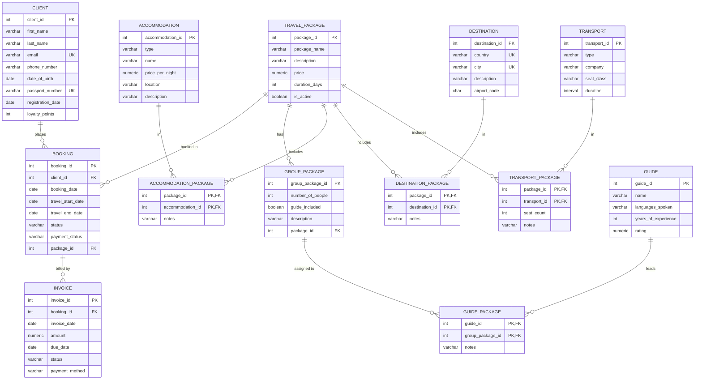

# Entity–Relationship Diagram

Generated from [`sql/ddl.sql`](../sql/ddl.sql). Renders inline on GitHub.

```mermaid
erDiagram
    CLIENT ||--o{ BOOKING : "places"
    TRAVEL_PACKAGE ||--o{ BOOKING : "booked in"
    BOOKING ||--o{ INVOICE : "billed by"
    TRAVEL_PACKAGE ||--o{ GROUP_PACKAGE : "has"
    TRAVEL_PACKAGE ||--o{ ACCOMMODATION_PACKAGE : "includes"
    ACCOMMODATION ||--o{ ACCOMMODATION_PACKAGE : "in"
    TRAVEL_PACKAGE ||--o{ DESTINATION_PACKAGE : "includes"
    DESTINATION ||--o{ DESTINATION_PACKAGE : "in"
    TRAVEL_PACKAGE ||--o{ TRANSPORT_PACKAGE : "includes"
    TRANSPORT ||--o{ TRANSPORT_PACKAGE : "in"
    GUIDE ||--o{ GUIDE_PACKAGE : "leads"
    GROUP_PACKAGE ||--o{ GUIDE_PACKAGE : "assigned to"

    ACCOMMODATION {
        int accommodation_id PK
        varchar type
        varchar name
        numeric price_per_night
        varchar location
        varchar description
    }
    CLIENT {
        int client_id PK
        varchar first_name
        varchar last_name
        varchar email UK
        varchar phone_number
        date date_of_birth
        varchar passport_number UK
        date registration_date
        int loyalty_points
    }
    TRAVEL_PACKAGE {
        int package_id PK
        varchar package_name
        varchar description
        numeric price
        int duration_days
        boolean is_active
    }
    DESTINATION {
        int destination_id PK
        varchar country UK
        varchar city UK
        varchar description
        char airport_code
    }
    TRANSPORT {
        int transport_id PK
        varchar type
        varchar company
        varchar seat_class
        interval duration
    }
    GUIDE {
        int guide_id PK
        varchar name
        varchar languages_spoken
        int years_of_experience
        numeric rating
    }
    BOOKING {
        int booking_id PK
        int client_id FK
        date booking_date
        date travel_start_date
        date travel_end_date
        varchar status
        varchar payment_status
        int package_id FK
    }
    INVOICE {
        int invoice_id PK
        int booking_id FK
        date invoice_date
        numeric amount
        date due_date
        varchar status
        varchar payment_method
    }
    GROUP_PACKAGE {
        int group_package_id PK
        int number_of_people
        boolean guide_included
        varchar description
        int package_id FK
    }
    ACCOMMODATION_PACKAGE {
        int package_id PK,FK
        int accommodation_id PK,FK
        varchar notes
    }
    DESTINATION_PACKAGE {
        int package_id PK,FK
        int destination_id PK,FK
        varchar notes
    }
    TRANSPORT_PACKAGE {
        int package_id PK,FK
        int transport_id PK,FK
        int seat_count
        varchar notes
    }
    GUIDE_PACKAGE {
        int guide_id PK,FK
        int group_package_id PK,FK
        varchar notes
    }
```
